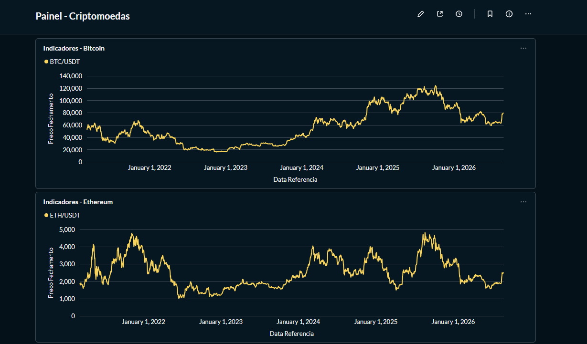
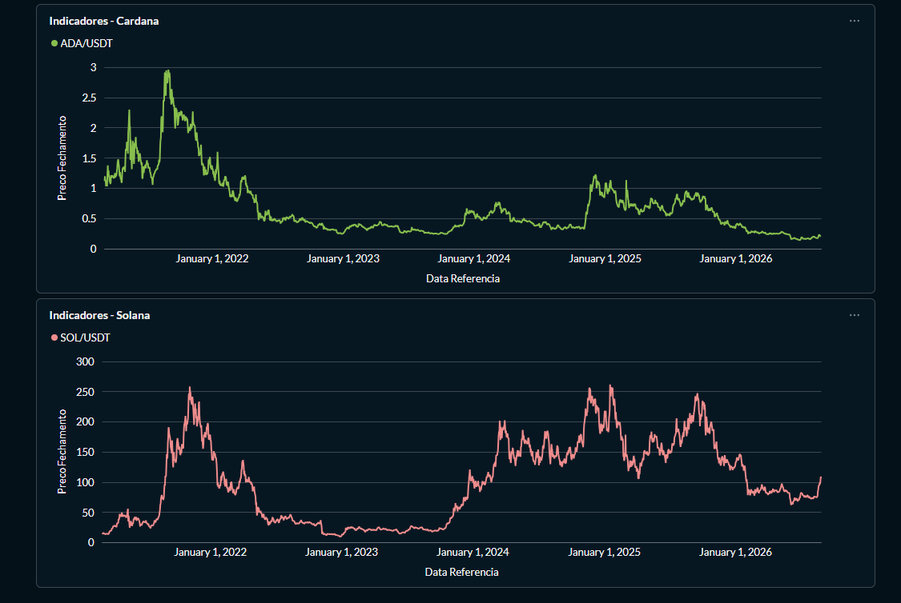

# Crypto Analytics: Data Lakehouse Multi-Ativos


---

## Sobre o Projeto

Este projeto implementa uma arquitetura **Data Lakehouse (Medallion)** completa e conteinerizada para extração, transformação, modelagem e visualização de indicadores financeiros do mercado de criptomoedas (**BTC, ETH, SOL e ADA**).

O pipeline é totalmente automatizado e construído com foco em **escalabilidade, governança de dados e qualidade** das métricas finais disponibilizadas para tomada de decisão.

---

## Arquitetura de Dados


| Camada | Tecnologia | Formato | Descrição |
|--------|------------|---------|-----------|
| **Origem** | Binance API (ccxt) | JSON | Dados OHLCV brutos |
| **Bronze** | MinIO (S3) | JSON | Dados imutáveis, particionados por ativo |
| **Silver** | MinIO (S3) | Parquet | Dados consolidados, limpos, tipados |
| **Gold** | PostgreSQL + dbt | SQL/Table | Indicadores modelados e testados |
| **Consumo** | Metabase | Dashboards | Visualizações interativas |

### Fluxo Resumido

```
Binance API → Bronze (JSON) → Silver (Parquet) → PostgreSQL (Staging) → dbt (Gold) → Metabase
```

---

## Stack Tecnológica

| Componente | Função |
|------------|--------|
| **Python 3.12** | Linguagem principal dos scripts ETL |
| **Apache Airflow 2.9** | Orquestração e agendamento do pipeline |
| **MinIO** | Data Lake compatível S3 (camadas Bronze/Silver) |
| **PostgreSQL 16** | Data Warehouse (camada Gold/Staging) |
| **dbt (Data Build Tool)** | Modelagem SQL, testes e documentação |
| **Metabase** | Business Intelligence e dashboards |
| **Docker & Docker Compose** | Infraestrutura conteinerizada |
| **Pandas + PyArrow** | Processamento de dados e Parquet |
| **ccxt** | Cliente unificado para exchanges de cripto |

---

## Dashboard Executivo




O painel final permite ao usuário navegar entre os ativos disponíveis (Bitcoin, Ethereum, Solana e Cardano) para analisar:
- Tendências históricas de preço desde 2018
- Variação percentual diária (Fechamento vs Abertura)
- Amplitude de preço (Máxima - Mínima) como proxy de volatilidade
- Volume de negociação

---

## Como Executar o Projeto

### Pré-requisitos

- [Git](https://git-scm.com/)
- [Docker Desktop](https://www.docker.com/products/docker-desktop/) (inclui Docker Compose)
- [Python 3.12](https://www.python.org/downloads/)
- [pip](https://pip.pypa.io/)
- Portas disponíveis: **3000** (Metabase), **8080** (Airflow), **9000/9001** (MinIO), **5433** (PostgreSQL)

### Passo a Passo

#### 1. Clone o repositório

```bash
git clone https://github.com/pedro-g-neto/crypto_analytics.git
cd crypto_analytics
```

#### 2. Instale as dependências Python

```bash
python -m venv venv
source venv/bin/activate    # Linux/Mac
# ou
venv\Scripts\activate       # Windows

pip install -r requirements.txt
```

#### 3. Configure as variáveis de ambiente

Copie o arquivo de exemplo e ajuste se necessário:

```bash
cp .env.example .env
```

O arquivo `.env` deve conter (valores padrão já funcionam com o Docker Compose):

```ini
# MinIO (Data Lake)
MINIO_ENDPOINT=http://minio:9000
MINIO_ACCESS_KEY=minioadmin
MINIO_SECRET_KEY=minioadmin123

# PostgreSQL (Data Warehouse)
POSTGRES_USER=postgres
POSTGRES_PASSWORD=postgres
POSTGRES_DB=crypto_db
POSTGRES_PORT=5432
POSTGRES_HOST=postgres_data

# Usuário da aplicação
APP_DB_USER=docker
APP_DB_PASSWORD=docker
APP_DB_NAME=docker
```

#### 4. Configure o perfil do dbt

```bash
cp meu_projeto_dbt/profiles.yml.example meu_projeto_dbt/profiles.yml
```

> **Nota:** O arquivo `profiles.yml` usa os mesmos valores do `.env` acima (host `postgres_data`, usuário `postgres`, senha `postgres`, banco `crypto_db`).

#### 5. Inicie a infraestrutura

```bash
docker compose up -d
```

Aguarde ~2 minutos para todos os containers estarem saudáveis.

#### 6. Verifique os serviços

| Serviço | URL | Credenciais Iniciais |
|---------|-----|---------------------|
| **Airflow** | http://localhost:8080 | Usuário: `admin` / Senha: `admin` (primeiro acesso) |
| **MinIO Console** | http://localhost:9001 | Usuário: `minioadmin` / Senha: `minioadmin123` |
| **Metabase** | http://localhost:3000 | Configure na primeira vez |
| **PostgreSQL** | localhost:5433 | Usuário: `postgres` / Senha: `postgres` / DB: `crypto_db` |

#### 7. Crie os buckets no MinIO (opcional - o pipeline cria automaticamente)

Acesse o MinIO Console (http://localhost:9001) e crie os buckets:
- `bronze` (para dados brutos)
- `silver` (para dados processados)

#### 8. Execute o pipeline manualmente (opcional)

```bash
# Extração completa (carga histórica desde 2018)
python extracao_binance.py

# Transformação Bronze → Silver
python transformacao_silver.py

# Carga Silver → PostgreSQL
python carga_postgres.py

# Modelagem dbt (cria tabelas Gold + roda testes)
cd meu_projeto_dbt && dbt run --profiles-dir . && dbt test --profiles-dir .
```

> O Airflow agenda execução diária às **03:00** (horário de Brasília) via `cron: 0 3 * * *`.

---

## Estrutura do Projeto

```
crypto_analytics/
├── .github/                    # GitHub Actions (futuro)
├── assets/                     # Imagens para documentação
│   ├── diagrama_arquitetural.svg
│   ├── painel1.png
│   └── painel2.png
├── dags/
│   └── crypto_dag.py           # DAG do Airflow
├── meu_projeto_dbt/            # Projeto dbt
│   ├── models/
│   │   ├── gold_cripto_indicadores.sql
│   │   ├── schema.yml          # Testes de qualidade
│   │   └── sources.yml         # Definição da fonte Silver
│   ├── profiles.yml.example    # Template de conexão
│   └── dbt_project.yml
├── .env.example                # Template de variáveis
├── .gitignore
├── requirements.txt            # Dependências Python
├── docker-compose.yml
├── extracao_binance.py         # Bronze: API Binance → MinIO
├── transformacao_silver.py     # Silver: JSON → Parquet consolidado
├── carga_postgres.py           # Gold: Parquet → PostgreSQL
├── LICENSE
└── README.md
```

---

## dbt Project: `meu_projeto_dbt/`

### `dbt_project.yml`

```yaml
name: 'meu_projeto_dbt'
version: '1.0.0'
profile: 'meu_projeto_dbt'
```

### `profiles.yml` (exemplo)

```yaml
meu_projeto_dbt:
  target: dev
  outputs:
    dev:
      type: postgres
      threads: 1
      host: postgres_data
      port: 5432
      user: postgres
      pass: postgres
      dbname: crypto_db
      schema: public
```

### `models/sources.yml` - Definição da fonte

```yaml
sources:
  - name: camada_silver
    schema: public 
    tables:
      - name: staging_cripto_ativos
        description: "Tabela de staging para ativos de criptomoedas"
```

### `models/gold_cripto_indicadores.sql` - Modelo de indicadores

```sql
WITH historico_precos AS (
    SELECT * 
    FROM {{ source('camada_silver', 'staging_cripto_ativos') }}
)

SELECT
    simbolo,
    DATE(data_pregao) AS data_referencia,
    preco_abertura,
    preco_fechamento,
    
    -- Variação Percentual Diária
    ROUND(CAST(((preco_fechamento - preco_abertura) / preco_abertura) * 100 AS NUMERIC), 2) AS variacao_percentual,
    
    -- Amplitude de Preço
    ROUND(CAST((preco_maximo - preco_minimo) AS NUMERIC), 2) AS amplitude_dolares,
    
    volume
FROM historico_precos
ORDER BY simbolo ASC, data_referencia DESC
```

### `models/schema.yml` - Testes de qualidade de dados

```yaml
version: 2

models:
  - name: gold_cripto_indicadores
    description: "Tabela de indicadores financeiros diários das criptomoedas, contendo variação percentual e volatilidade."
    columns:
      - name: simbolo
        description: "Par de negociação do ativo"
        tests:
          - not_null
          - unique

      - name: data_referencia
        description: "Data do pregão (Fuso local)."
        tests:
          - not_null

      - name: preco_abertura
        description: "Preço de abertura em Dólares."
        tests:
          - not_null

      - name: variacao_percentual
        description: "Variação percentual do preço de fechamento em relação à abertura."
        tests:
          - not_null

      - name: amplitude_dolares
        description: "Amplitude de preço (máxima - mínima) em Dólares."
        tests:
          - not_null
```

---

## Estrutura das Tabelas Gold (dbt)

### `gold_cripto_indicadores`

| Coluna | Tipo | Descrição |
|--------|------|-----------|
| `simbolo` | VARCHAR | Par de negociação (ex: BTC/USDT) |
| `data_referencia` | DATE | Data do pregão (fuso América/Recife) |
| `preco_abertura` | NUMERIC | Preço de abertura (USD) |
| `preco_fechamento` | NUMERIC | Preço de fechamento (USD) |
| `variacao_percentual` | NUMERIC(10,2) | `(fechamento - abertura) / abertura * 100` |
| `amplitude_dolares` | NUMERIC(10,2) | `maxima - minima` (volatilidade) |
| `volume` | NUMERIC | Volume negociado |

---

## Destaques Técnicos

### 🔄 Pipeline Idempotente
- Scripts desenvolvidos para garantir que reexecuções **não gerem duplicatas**
- Uso de `if_exists='replace'` na carga PostgreSQL
- dbt com materialização `table` e chave primária composta (`simbolo` + `data_referencia`)

### 🏗️ Arquitetura Medallion Implementada
- **Bronze**: Armazenamento imutável (append-only) de JSON bruto
- **Silver**: Transformação tabular, tipagem, fusos horários, Parquet colunar
- **Gold**: Modelagem dimensional, indicadores calculados, testes automatizados

### 📊 Data Quality com dbt
Testes que garantem integridade dos dados:
- `not_null`: Garante que colunas críticas nunca sejam nulas
- `unique`: Chave primária composta (`simbolo` + `data_referencia`)

### 🌐 Multi-Ativo Sem Duplicação
- Pipeline **agnóstico** processa BTC, ETH, SOL, ADA em loop único
- Configuração centralizada em listas `simbolos = ['BTC/USDT', ...]`
- Consolidação em um único arquivo Parquet e tabela Gold

### ⏰ Tratamento Correto de Fusos Horários
```python
# UTC (Binance) → America/Recife (Horário de Brasília)
df['data_pregao'] = (pd.to_datetime(df['timestamp_ms'], unit='ms')
                     .dt.tz_localize('UTC')
                     .dt.tz_convert('America/Recife')
                     .dt.tz_localize(None))
```

---

## Solução de Problemas Comuns

### Airflow não inicia / DAG não aparece
```bash
# Verifique logs
docker compose logs airflow

# Reinicie se necessário
docker compose restart airflow
```

### MinIO: "Bucket não encontrado"
- Acesse http://localhost:9001
- Crie manualmente os buckets `bronze` e `silver`
- Ou execute o script de extração que cria automaticamente

### PostgreSQL: Conexão recusada
```bash
# Verifique se o container está saudável
docker compose ps postgres_data

# Aguarde healthcheck passar (pode levar 30-60s)
```

### dbt: "Relation does not exist"
```bash
# Certifique-se que a carga no Postgres rodou antes
python carga_postgres.py

# Depois rode dbt
cd meu_projeto_dbt && dbt run --profiles-dir .
```

### Metabase não conecta ao PostgreSQL
- Host: `postgres_data` (nome do serviço Docker)
- Porta: `5432` (interna) / `5433` (exposta no host)
- Banco: `crypto_db`
- Usuário/Senha: conforme `.env`

---

## Contribuição

1. Fork o projeto
2. Crie uma branch (`git checkout -b feature/nova-funcionalidade`)
3. Commit suas mudanças (`git commit -m 'feat: adiciona nova funcionalidade'`)
4. Push para a branch (`git push origin feature/nova-funcionalidade`)
5. Abra um Pull Request

---

## Licença

Este projeto está sob a licença MIT. Veja o arquivo [LICENSE](LICENSE) para mais detalhes.

---

## Autor

**Pedro Gomes de Andrade Neto**

- GitHub: [@pedro-g-neto](https://github.com/pedro-g-neto)
- Linkedin: [@pedrogneto](https://linkedin.com/in/pedrogneto)

---

> ⭐ Se este projeto foi útil para seus estudos, deixe uma estrela no repositório!
